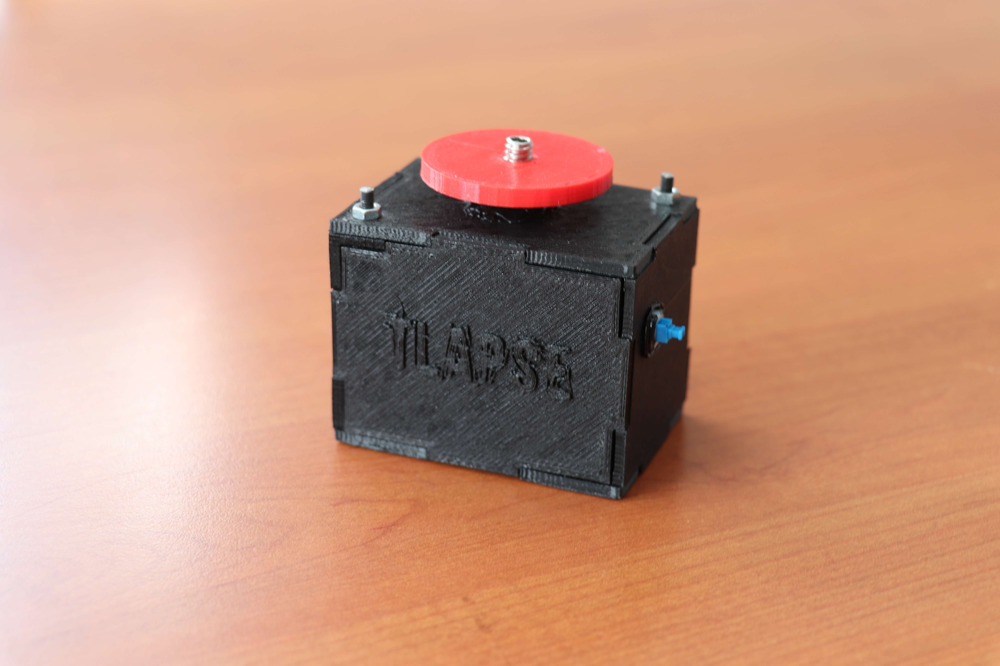
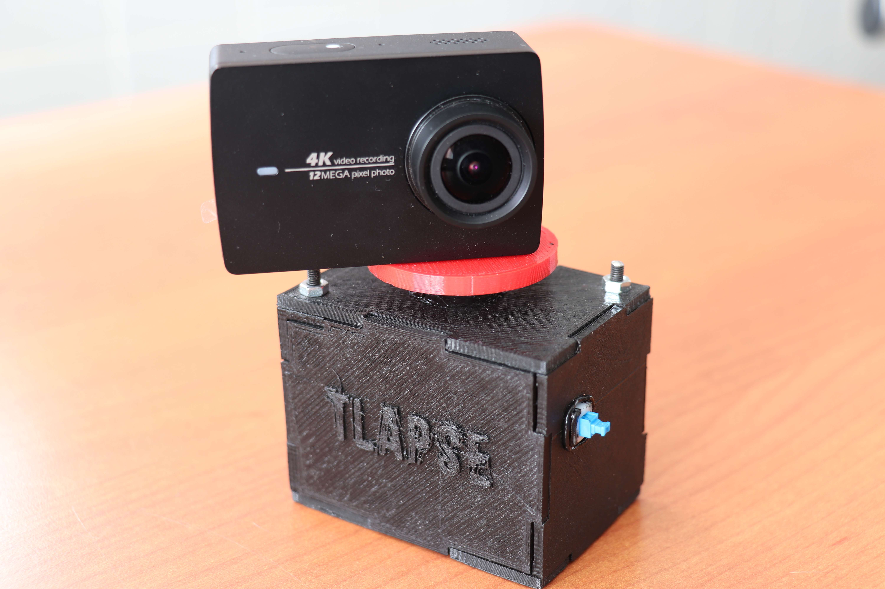

# TLapse
TLapse is a self-built portable instrument for recording timelapse in motion (hyperlapse) on the pan axis. It is suitable for action cameras such as GoPro, Yi, etc.

## Parameters
Allows you to record parameterized timelapses according to:
- duration of the timelapse
- rotation angle
- interval between one shot and the next

## Components used
(All components are available for example on Aliexpress)
- Wemos D1 Mini
- Wemos Battery Shield
- 180° servo motor
- 1200 mah battery
- On / Off button

## Main features
- small dimensions: 75 x 70 x 50 mm
- portable thanks to the rechargeable battery via micro usb
- programmable via WiFi connection without the need to install any application
- possibility of mounting on a tripod

## Usage
1. TLapse ignition
2. connect to TLapse via WiFi (default pass is: `tl123456`)
3. setting timelapse duration in minutes, rotation angle and interval
4. done!

---

[3D printed box (designed with SketchUp)](3DModel/Timelapse.skp)

[Software code (Arduino)](Code/Timelapse/Timelapse.ino)